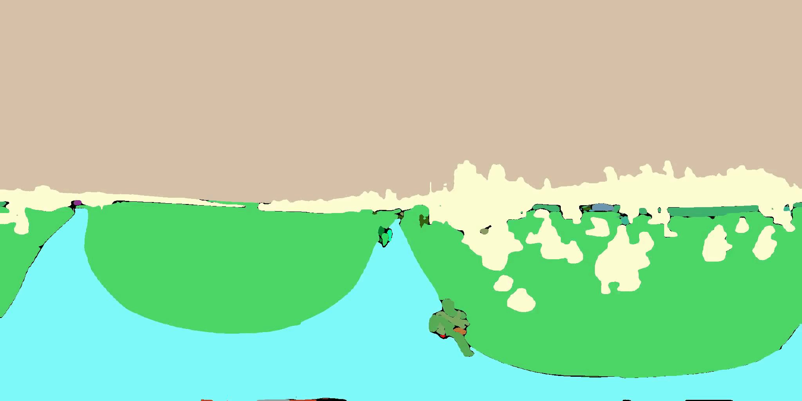

# Leader360V : A Large-scale, Real-world 360 Video Dataset for Multi-task Learning in Diverse Environments

     
   

## 📷 Quick Demos with Different Scenarios
More results and details can be found on our [📖 Project Homepage](https://leader360v.github.io/Leader360_Homepage_VUE/). 

<table class="center">
    <tr>
    <td></td>
    <td></td>
    <td></td>
    </tr>
</table>
<!-- 
Model：<a href="https://civitai.com/models/30240/toonyou">ToonYou</a>
 -->

<table>
    <tr>
    <td></td>
    <td></td>
    <td></td>
    </tr>
</table>

## 📷 Quick Demos of Annotation
More results and details can be found on our [📖 Project Homepage](https://leader360v.github.io/Leader360_Homepage_VUE/). 

<table class="center">
    <tr>
    <td>Raw Videos</td>
    <td>Pipeline Annotation</td>
    <td>Manual Annotation</td>
    </tr>
</table>

<table>
    <tr>
    <td></td>
    <td></td>
    <td></td>
    </tr>
</table>

<table>
    <tr>
    <td></td>
    <td></td>
    <td></td>
    </tr>
</table>

<table>
    <tr>
    <td></td>
    <td></td>
    <td></td>
    </tr>
</table>

🌟 For mare details, please refer to our project homepage: 
"[Leader360V : A Large-scale, Real-world 360 Video Dataset for Multi-task Learning in Diverse Environments](https://leader360v.github.io/Leader360V_HomePage)".

[[🍓Project Homepage](https://leader360v.github.io/Leader360V_HomePage)]

[📖 Explore More](https://leader360v.github.io/Leader360_Homepage_VUE/)]

[[📊 Huggingface Dataset](https://huggingface.co/datasets/Leader360V/Leader360V)]

## About Leader360V

- Leader360V is the first large-scale (10K+), labeled real-world 360 video datasets for instance segmentation and tracking. Our datasets enjoy high scene diversity, ranging from indoor and urban settings to natural and dynamic outdoor scenes.

- All videos in this dataset have undergone standardized preprocessing, including video clipping, facial anonymization for privacy protection, and balanced scene distribution across categories.

- Regarding dataset composition, we integrated existing 360 video datasets (either unlabeled or annotated for single tasks) and supplemented them with newly collected self-recorded videos. All content was then re-annotated to support joint segmentation and tracking tasks.

- **Due to the large size of the dataset, we have currently uploaded only a selection of demos. We plan to upload all files at a later date to facilitate community research.** 

